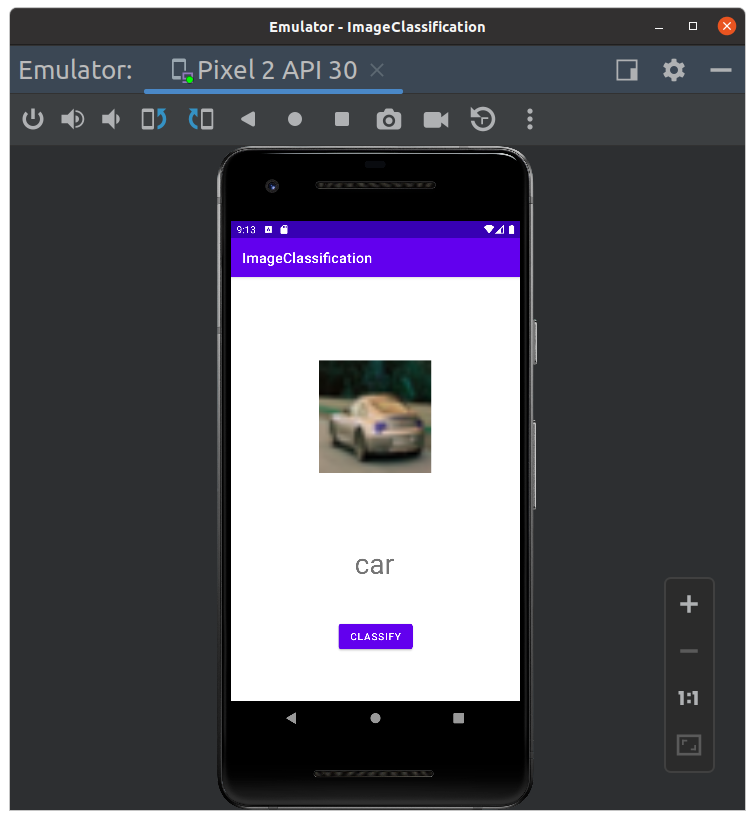
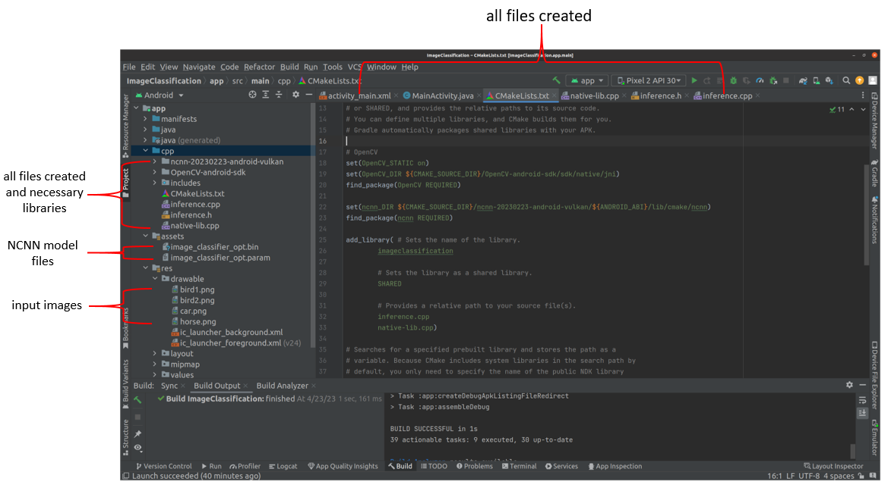

# Deployment of Image Classification Model with NCNN Inference Engine into Android

This repo integrates the C++ image classification application with the NCNN inference engine, which is generated by my previous repo (https://github.com/freshtechyy/NCNN-Deployment-image-classification-example), into Android for deep learning model deployment on mobile phone.

## Dependencies

* Ubuntu 20.04
* android-studio-2022.1.1.21-linux
* NDK
* ncnn-20230223-android-vulkan
* OpenCV-android-sdk
* CUDA 11.4
* CUDNN 8.2.4

## Clone the Image Classification Android App
```bash
git clone https://github.com/freshtechyy/NCNN-Android-image-classification-example.git
```

## Android Studio Installation
Android studio can be installed by following Android Studio installation page (https://developer.android.com/studio/install).

## NDK Installation in Android Studio
NDK can be installed via Android Studio by following **Tools -> SDK Managers -> SDK Tools**. A Settings window pops up and NDK can be installed by clicking **NDK** checkbox and **Apply** button.

## Installation of OpenCV for Android
* Download Android release of OpenCV from https://opencv.org/releases/;
* Extract it and move the subfolder OpenCV-android-sdk under it into app/src/main/cpp in the image classification app;
* Set OpenCV_DIR in app/src/main/cpp/CMakeLists.txt.

## Installation of NCNN for Android
* Download ncnn-android-vulkan from https://github.com/Tencent/ncnn/releases, e.g. ncnn-20230223-android-vulkan.zip;
* Extract it into app/src/main/cpp;
* Set the ncnn_DIR path in app/src/main/cpp/CMakeLists.txt.

## Run the App
* Open Android Studio.
* In Android Sudio, perform **Build->Make Project** to build the project.
* Click the **Run 'app'** button to run the project. You will see the window below.
<center> 

</center>

* Click the **CLASSIFY** button to get classification result.
<center> 

</center>

## Project Structure
The project structure is shown in the following figure. 
<center> 

</center>

The NCNN model files are placed in the **asset** folder, and the input image files are placed in the **drawable** folder.

## References
* Android. https://developer.android.com/studio/install, 2023.
* Tencent, NVIDIA CUDA Convolutional Neural Network, https://github.com/tencent/ncnn, 2019.